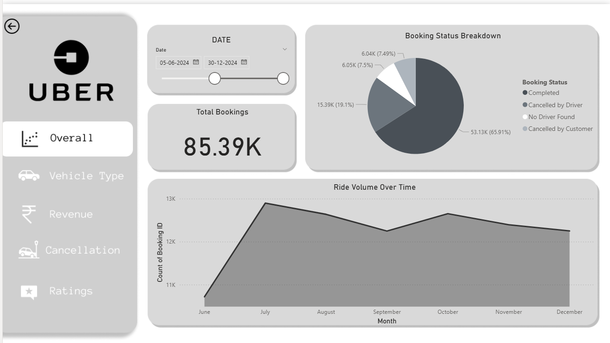
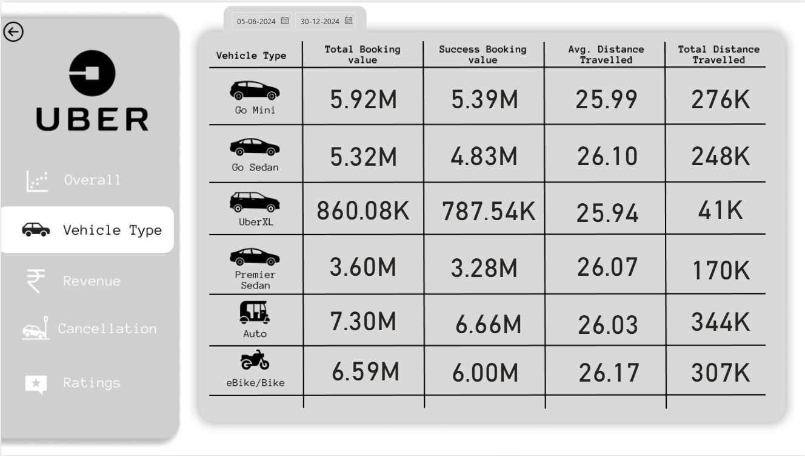
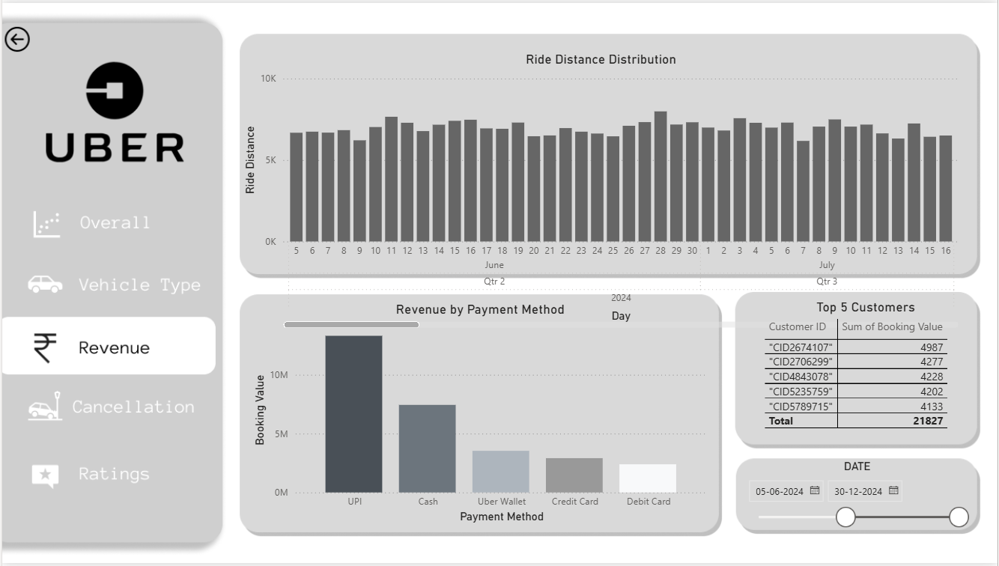
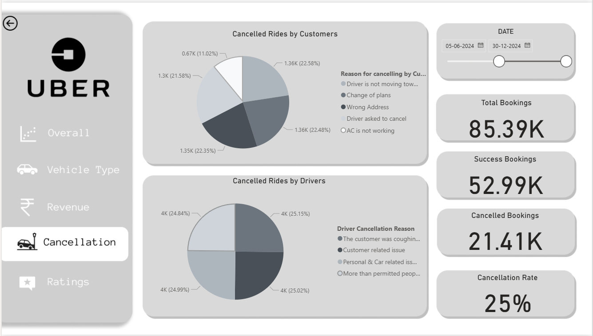
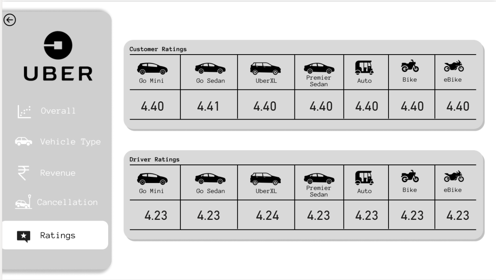

# Uber Cab Analysis  Dashboard using Power BI

## Preview

## Overview

## Dataset
 Uber Ride Analytics Dataset 2024
This comprehensive dataset contains detailed ride-sharing data from Uber operations for the year 2024, providing rich insights into booking patterns, vehicle performance, revenue streams, cancellation behaviors, and customer satisfaction metrics.

 Dataset Overview
The dataset captures 148,770 total bookings across multiple vehicle types and provides a complete view of ride-sharing operations including successful rides, cancellations, customer behaviors, and financial metrics.

## Tools Used

- Power BI

## Usage

To explore the dashboard:

1. Download Power BI desktop application.
2. Clone this repository.
3. Open `Uber Dashboard.pbix` with Power BI.
4. Interact with the dashboard.

